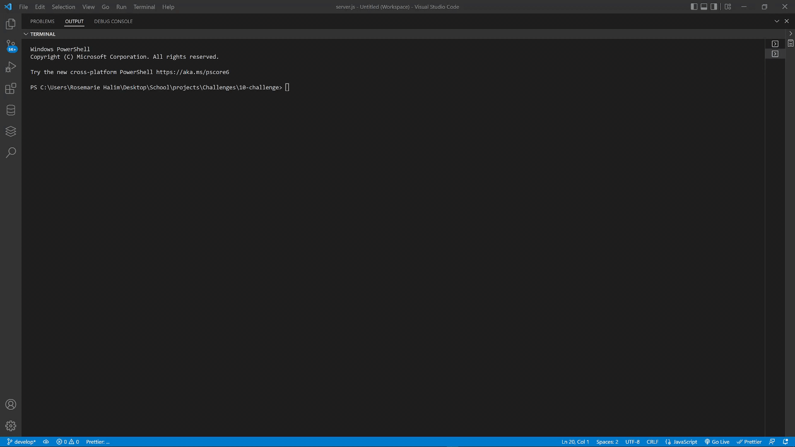

#   Challenge 10 - Employee Tracker

##  User Story

AS A business owner
I WANT to be able to view and manage the departments, roles, and employees in my company
SO THAT I can organize and plan my business

## Acceptance Criteria

GIVEN a command-line application that accepts user input
WHEN I start the application
THEN I am presented with the following options: view all departments, view all roles, view all employees, add a department, add a role, add an employee, and update an employee role
WHEN I choose to view all departments
THEN I am presented with a formatted table showing department names and department ids
WHEN I choose to view all roles
THEN I am presented with the job title, role id, the department that role belongs to, and the salary for that role
WHEN I choose to view all employees
THEN I am presented with a formatted table showing employee data, including employee ids, first names, last names, job titles, departments, salaries, and managers that the employees report to
WHEN I choose to add a department
THEN I am prompted to enter the name of the department and that department is added to the database
WHEN I choose to add a role
THEN I am prompted to enter the name, salary, and department for the role and that role is added to the database
WHEN I choose to add an employee
THEN I am prompted to enter the employee’s first name, last name, role, and manager, and that employee is added to the database
WHEN I choose to update an employee role
THEN I am prompted to select an employee to update and their new role and this information is updated in the database

---

# Challenge 10

## Purpose
Deploy a note taking app to help business owners organize and track tasks.

## Built With
* JavaScript
* Node.js
* Inquirer
* MySql2

## Website
https://rosemariehalim.github.io/10-challenge/

---

## Process

* planned out code
* installed inquirer, mysql2, and console.table packages
* created server.js file
* created db folder with db, schema, and seeds sql files
* used module reference code
* cleaned up and tested SQL code
* worked on server.js file and inquirer code
* tested and fixed code